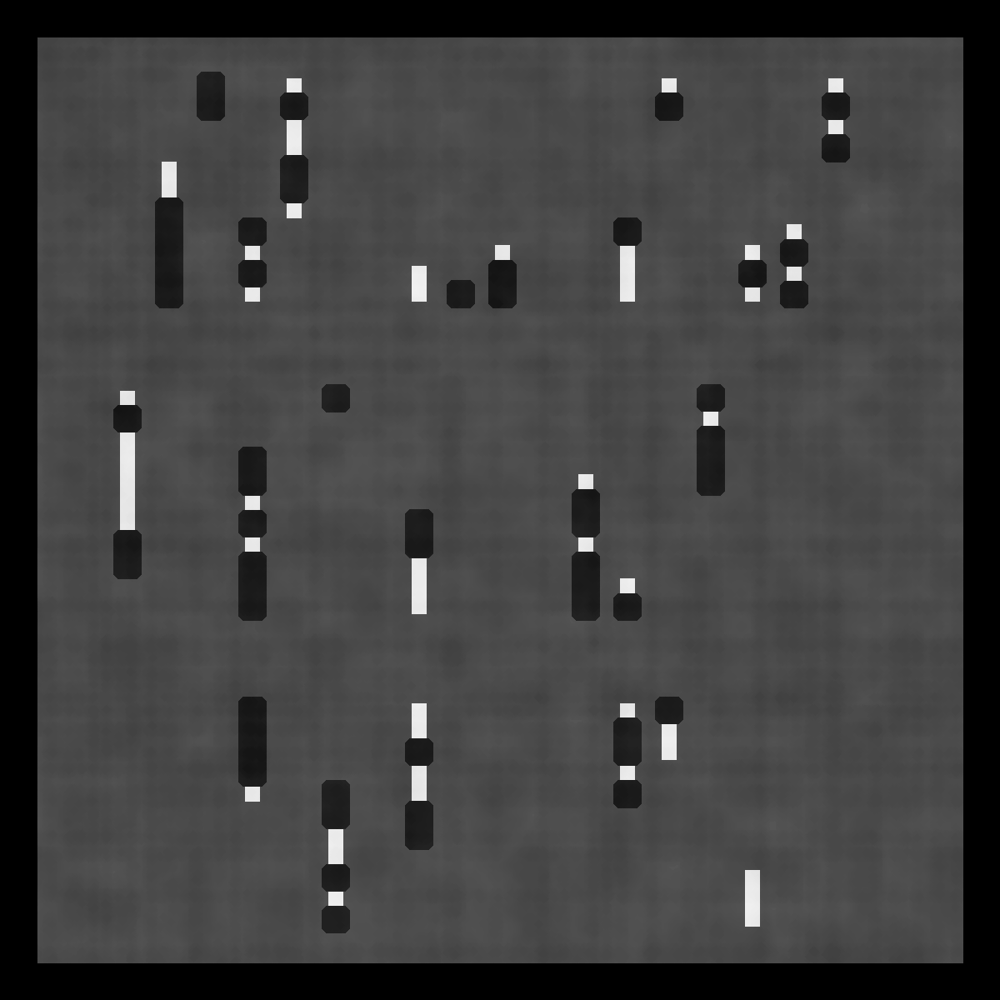
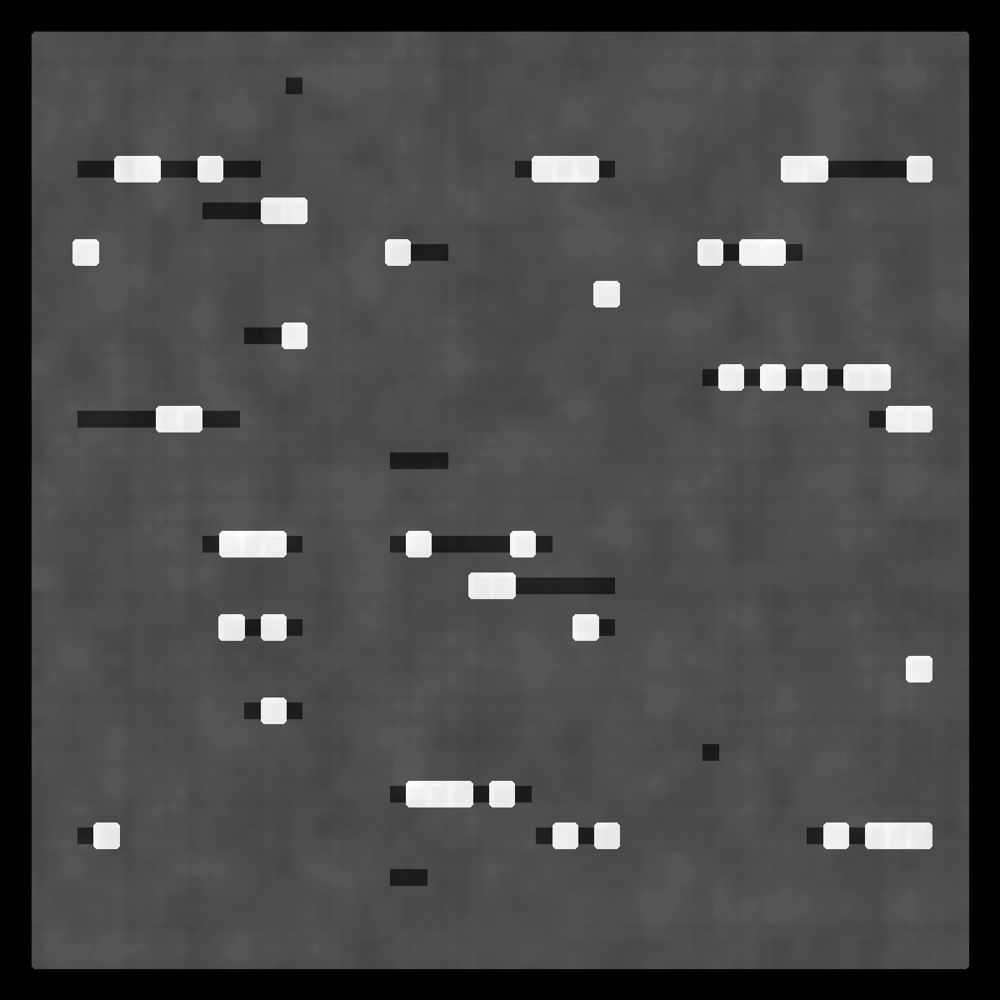

# muldrew

## Description
Piece inspired by the cover of the Shabason / Gunning album, "Muldrew", designed by Alan Briand. The algorithm was written using Processing and the number and orientation of each chain of shapes is randomly sampled each time the script is run. After all shapes have been drawn, a custom filtering process is applied a random number of times to produce the final image. Here are a few example outputs of the script. 

 
