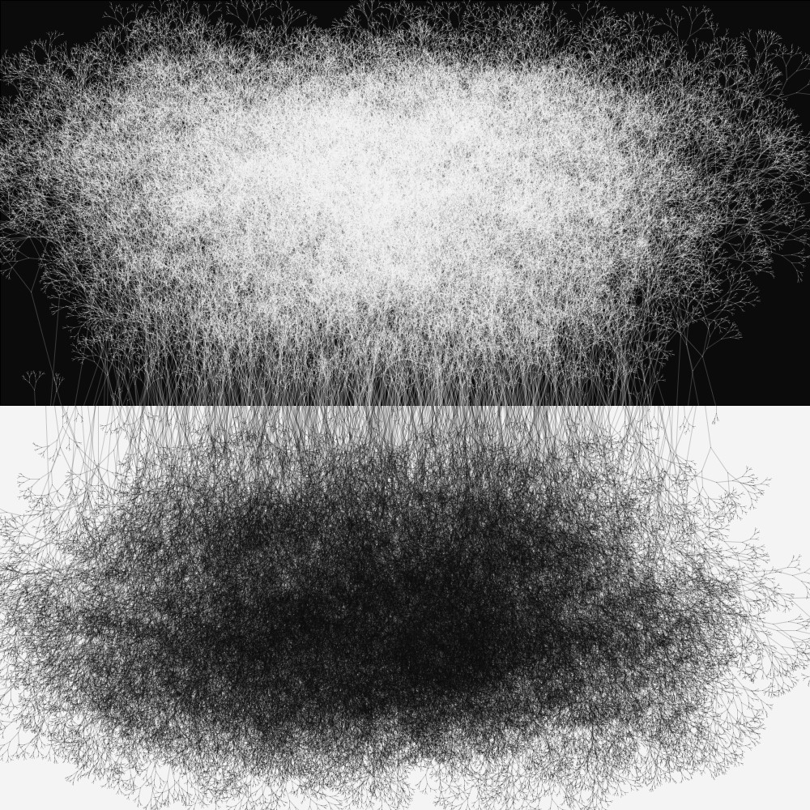
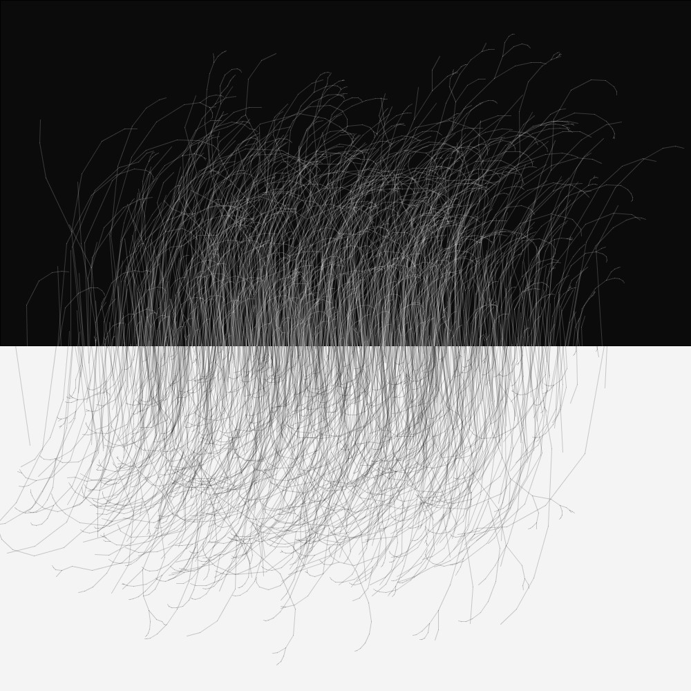
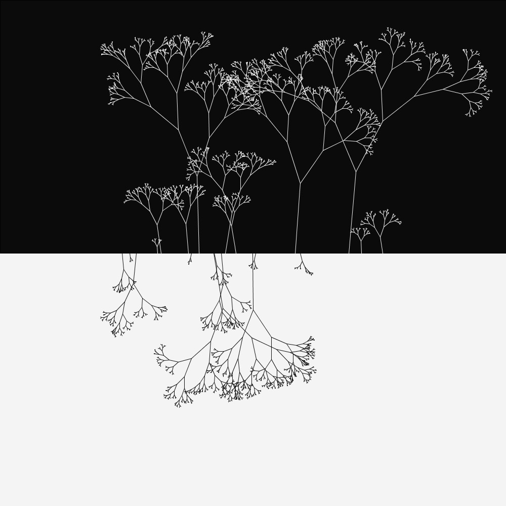

# umbrage

## Description
This idea came to me in a dream which of course was essentially nonsensical but it gradually evolved into something I could actually put in code. 
The algorithm was written in processing using fractal trees with random branch lengths and angles. Here are a few example outputs with varying input parameters.

 
